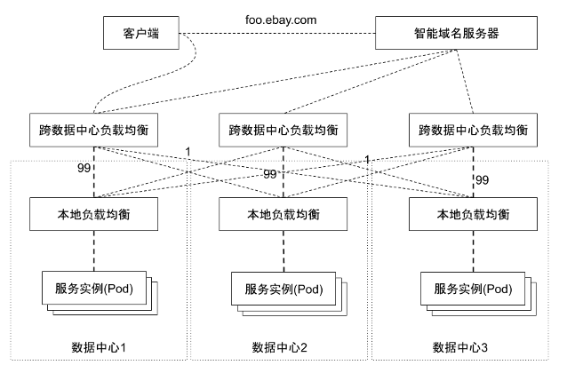
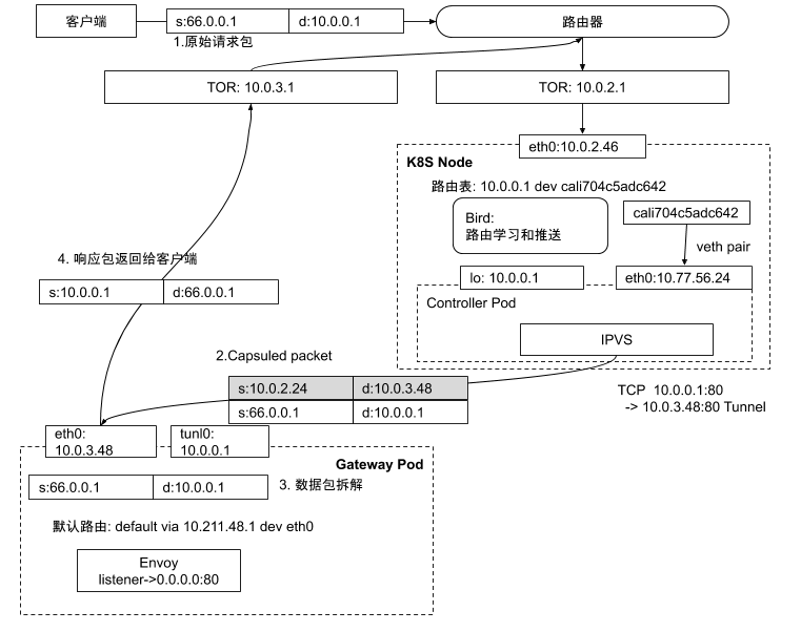

# eBay基于Istio的统一流量管理实践

## 综述
Kubernetes作为eBay的统一云平台，统管了在线业务、大数据、搜索后台等多种异构应用。集群数量高达上百，其中的大型集群中，单个集群运行数千个微服务，数十万Pod。不同类型的应用，针对流量管控的需求也各有不同，如何用一套统一的模型将各种流量管控需求统一起来是eBay多年来一直面临的挑战。

以云应用为例，为实现跨数据中心高可用的需求，生产应用的网络拓扑可以简要描述如下：

- eBay采用多活数据中心的网络拓扑，因此任何生产应用都需要完成跨三个数据中心的部署。
- 为满足单集群的高可用，针对每个数据中心，任何应用都需进行多副本部署，并配置负载均衡。
- 以实现全站微服务化，但为保证高可用，服务之间的调用仍以南北流量为主。
- 针对核心应用，除集群本地负载均衡配置以外，还需配置跨数据中心负载均衡，并通过权重控制将99%的请求转入本地数据中心，将1%的流量转向跨地域的数据中心。该配置的主要目的是当某应用的所有本地服饰实例失效时，运维可快速将跨数据中心负载均衡器上指向本地的99%流量的成员禁止掉，流量可在秒级转向其他数据中心从而保护业务不受影响。业务版本发布、硬件故障、防火墙，路由器等网络设备变更都有可能导致本地服务实例失效。

## 部署模式
eBay有多个数据中心，每个数据中心包含多个有独立供电和制冷的可用区（Availability Zone），每个可用区部署多个Kubernetes集群。因每个可用区的网络延迟较小，因此我们当前以可用区为最小管理域搭建Istio控制面。在每个可用区内，选择一个Kubernetes集群作为网关集群，部署Istio Primary，在同一可用区的其他集群安装Istio Remote。在这样的配置下，同一可用区的多个集群内服务和服务之间的通信均转化为东西流量，跨可用区的通信需要经由Istio 网关。

此种Istio部署模式主要依托于Kubernetes的运营模式，我们将不同可用区的计算节点搭建了不同的Kubernetes集群。这样的配置可实现同一网格内的服务访问低延迟，并且使得服务网格的规模可用，并对故障域做了很好的管控。

## 接入网关
作为互联网公司，流量管理中最重要的一环就是如何接收来自公网的用户请求。将群外部客户端发起的请求转入集群内部，是流量管理需要解决的第一个问题。

在纯软件架构下，负载均衡组件被划分为基于四层的负载均衡器和基于七层的API网关。四层负载均衡器负责提供服务的虚拟IP地址，接收客户请求，并将客户请求转入上游实例。七层API网关负责基于应用层协议的高级路由功能，比如TLS卸载，基于访问路径的跳转，HTTP协议包头的修改等等。

### 四层网关
四层网关的主要技术手段是通过网络地址转换（NAT)或者隧道技术（Tunnel）等技术，将来外部客户端发至虚拟IP地址的用户请求转发至集群内部。网络地址转换是最常用的方法，其优势是简单易用，排查问题简单。IP Tunnel相较NAT技术配置更复杂，但是基于IP Tunnel技术通常能实现DSR，既保留了原始IP地址，又能有比较高的数据转发效率，因此与NAT相比是更优的方案。

在Kubernetes架构下，这些四层负载均衡器的控制面板可以定义为Kubernetes Pod以实现故障转移，扩缩容等高级功能。而基于Linux自带组件比如IPVS，即可实现基于四层的数据包转发。

四层网关的配置依赖于Kubernetes Service Controller完成以下配置：

- 虚拟IP地址分配，当用户创建Service对象以后，Service Controller需要从预先配置的公网IP中选择一个可用的虚拟IP地址分配给该服务。
- 配置IPVS接口，完成负载均衡规则的配置。
- 路由宣告，虚拟IP地址与物理设备的IP不一样，它没有绑定在任何物理设备上，但基于BGP协议和ECMP，它能让多个设备配置同一个IP地址的路由信息。当Service Controller为Service分配虚拟IP地址并配置好IPVS规则以后，Controller还需要将该虚拟IP地址从配置好的节点中宣告出去。基于BGP协议，数据中心中的其他路由器即可获知如何将虚拟IP地址转发至该网关节点。
  
  有了ECMP的支持，多个四层负载均衡组件行为一致，也就是他们配置一样的规则，宣告一样的IP，每个实例都会承载该虚拟IP地址的流量。相比主备模式的硬件负载均衡器，此方案的所有负载均衡节点都是Active模式，没有Standby设备的额外硬件开销。

每个节点的核心功能是负载均衡规则配置，包括以下特性：

- N元组哈希

基于源IP，源端口，目标IP，目标端口，以及协议的N元组哈希，保证针对同一个连接，总是选择同一个上游实例。路由器的ECMP哈希算法与设备相关，同样的N元组有可能会被转发至多个目标，在本场景中是四层负载均衡。只要在IPVS主机上按照N元组重新做哈希，那么无论请求被转发至哪个IPVS实例，都会被转发至相同的上游服务器。所有实例计算的的哈希结果都一致，这样多个IPVS实例之间不用同步状态。当一个节点出现故障时，其他节点可将请求转发至同一个上游。
- 一致性哈希

基于N元组的哈希算法，会尽量将请求平分到多个上游服务器，在Kubernetes世界里，上游服务器以Pod的形式存在，扩缩容，Failover是常见场景。在普通哈希算法中，目标的变动意味着大量的rehash，采用一致性哈希算法后，只需要将变动的部分重新哈希即可，减少了大量哈希计算的CPU开销。
- Connection Tracking

Connection Tracking表用来记录最近连接的后端选择结果，当IPVS模块处理数据进行负载均衡操作时，首先查询该连接表，如果发现对应的N元组已经有了对应的目标实例且该实例依然健康，那么直接复用此结果。如果不存在或者对应的实例状态不正常则需要基于一致性哈希重新计算，计算结果会被保存在该连接表中供后面的请求数据复用。
- 数据包封包

选择好对应的上游服务器以后，IPVS模块开始处理数据包。按照第五章的内容，内核协议栈在处理数据包是，可以基于NAT或者Tunnel两种模式，NAT的问题是用户原始IP会丢失，这里选取更优的Tunnel模式，IPVS模块会保持原始数据包不变，在原始数据包外面封装一层IP包头，数据包的内层包头源是客户端IP，目标是服务虚拟IP地址，外层包头源是IPVS PodIP，目标是上游服务器PodIP，然后基于IP over IP协议发送数据给上游。
- 健康检查

健康检查是负载均衡的基本功能，在我们打造的软件负载均衡中也需要。Seasaw 库有API支持多种健康检查模式，只需在控制器中调用接口对所有上游目标做健康检查，如果某个上游服务器检查失败，需要将IPVS中对应的转发规则删除掉。

基于软件的四层负载均衡有多重实现方式，基于操作系统自带的IPVS模块是最直接，成本最低的方案。当然IPVS在处理数据的过程中需要依赖操作系统协议栈，转发效率并非最高。如果需要更大的流量处理能力，有很多数据平面加速技术可用，比如DPDK和XDP。

### 七层应用网关
Istio提供Ingress Gateway，配合四层负载均衡，即可实现全站的入站流量高可用接入方案。

作为四层负载均衡的转发目标，七层API网关需要配合完成隧道技术的配置。因为四层负载均衡基于IP Tunnel配置转发规则，当它转发数据时，是以IP Over IP协议发送的数据包，作为目标，Envoy Pod在接收到请求以后，需要将IPIP包拆解。这需要在Enovy Pod中创建类型为IPIP的设备并绑定虚拟IP地址。

微服务架构网站的主站通常是数十到数百上甚至千个微服务的集合，不同微服务以不同访问路径注册在同一主域名下。同时API网关会有一些通用的访问控制策略，比如外网IP不能访问以/admin结尾的路径等，这些访问控制在Istio有很好的支持。

Envoy接收到请求后，会按照既定的七层转发规则将请求转发至对应的目标，对于边缘网关来说，这些目标通常是处于云端的服务虚拟IP地址。Envoy在接受到云端处理结果以后，需要将该请求转发回给客户端，因为该请求抵达Envoy Pod时是IPIP包，在操作系统卸载了外层包头以后，内层数据包包头是客户端IP和服务虚拟IP地址，Envoy在回包时，只需将源目标地址翻转再发送数据，该响应包即可走默认网关绕过IPVS而直接发送至客户端，此模式为大家熟知的DSR模式。

## 流量管理

### 协议升级
针对接入Istio的应用默认启用mTLS，这样如果是东西流量，则服务和服务之间的通信天然加密，站内流量的安全等级得到了提升。
### 应对规模化挑战
Istio的强大之处在于，通过一套模型将东西和南北流量统一管控，针对东西流量，无太多需要定制化的功能。我们生产化过程中主要的工作是持续集成和持续发布Pipeline的构建，以及大量的性能测试工作，并且基于规模性测试和性能测试结果，定义Istio运维模型。其中针对超大集群，Istio则面对比较多的挑战。

Istiod默认发现集群中所有的服务，并且每个服务的每个端口构建一个Envoy Cluster，若模式开启了sni-dnat模式，则Istiod还构建一份符合域名规范的Envoy Cluster。针对服务数量较多的超大规模集群，Envoy配置会变的超大。在早期版本中，我们经历了很多8000多个服务导致Istiod生成的配置超出Envoy能承受的上限而引发的接入网关完全不可用的故障。

Istio在后续的版本中，为Istio对象增加了ExportTo属性，以实现可见性控制。通过接入将接入的服务只export给需要的微服务，可控制Envoy的配置规模，降低Envoy的footprint，并提升推送效率。

虽然通过ExportTo可精简Envoy的配置，但是Istio控制面板依然会将集群内的所有服务都发现出来。针对超大规模集群，Istiod依然面临因为需要监控和处理的对象过多而导致的资源占用过大，处理效率过低的问题。社区1.9版本在推动Istiod基于Namespace Labels过滤监控对象的功能，这个功能有利于解决超大集群规模下，Istiod控制面板本身的规模和性能问题。

### 接入网关证书自动化
Istio基于Envoy的发现机制SDS实现了网站域名的证书管理，但是它要求管理员预先将证书放入Istio根Namespace，并且在创建Istio Gateway对象时，通过定义credentialName来引用预先定义的证书信息。这适用于同一Kubernetes集群只提供一个域名的场景，但针对域名动态创建的场景，这种半自动的运维模式显然是不可能的。需要实现自定义的SDS以完成与企业证书签发中心的对接，其方案可简单理解为，通过自定义控制器监控Istio Gateway对象中的hosts属性完成证书的自动签发，并且通过SDS将证书推送给Envoy。
### 接入域名自动化
同一应用网关可实现多个拥有不同域名的应用接入，针对不同域名的应用，需要完成域名配置的自动化。为实现该目标，定义了NameService对象，允许用户定义FQDN，TTL，不同DNS Provider，目标服务等等。在目标服务完成配置以后，域名配置可自动完成。
## 管理模型抽象和高级流量管控
Istio的模型抽象非常灵活，通过Istio对象可为应用定义不同网络拓扑。但同时面临诸多挑战：
- 针对数十个可用区，上百个Kubernetes集群，让用户面向每个集群做配置不现实。这样做的结果是管理混乱，客户需要关心太多基础架构细节，计算资源调控难度大，配置不统一，变更造成的故障可能性高。
- Istio对象无状态属性，很难直观获取配置是否正确、是否已推送完成等信息。
- 多路径软件接入网关的健康检查机制。

Kubernetes通过集群联邦实现多集群的管理，我们基于集群联邦实现了一套Federated AccessPoint，其核心是将Kubernetes中描述负载均衡的Service对象和Istio中描述网络流量的Gateway、VirtualService、DestinationRule、ServiceEntry、WorkloadEntry等对象定义为模板，将AvailabilityZone或者Kubernetes Cluster作为部署目标，并且支持Override属性的集群联邦对象。

针对此流量模型，提供丰富的策略控制，包括：
- PlacementPolicy控制，用户可以选则目标集群来完成流量配置，甚至可以选择关联的FederatedDeployment对象，使得AccessPoint自动发现目标集群并完成配置。
- 完成了状态上报，包括网关虚拟IP地址，网关FQDN，证书安装状态以及版本信息，路由策略是否配置完成等。这补齐了Istio自身的短板，使得任何部署在Istio的应用的网络配置状态一目了然。
- 发布策略控制，针对多集群的配置，可实现但集群的灰度发布，并且能够自动暂停发布，管理员验证单个集群的变更正确以后，再继续发布。通过此机制，避免因为全局流量变更产生的故障。
- 不同域名的AccessPoint可拥有不同的四层网关虚拟IP地址，以实现基于IP地址的四层网络隔离。
- 基于跨地域的流量管控，Istio实现了基于workload locality的故障转移策略和权重策略管理，基于这些策略可实现跨地域的高可用流量管理。

## Istio面临的机遇和挑战
Istio优势明显，它尝试将南北流量和东西流量作为一个统一命题管理起来，这使得基于同一套技术栈，将微服务架构从API网关演进到服务网格成为可能，其诸多特性使得Istio成为社区最活跃的开源服务网格项目。
- 可移植性，不仅支持Kubernetes，也支持虚拟平台Openstack以及Consul。
- 跨语种的服务网格平台，统一Java，Scala，Nodejs等诸多语言。
- Istio将南北和东西流量统一管理，统一服务网格和API网关用户体验，降低运营成本。
- 天然安全，自动化证书管理，认证授权的集成。
- 充分的功能支持，能看到的API网关的所有功能都有支持。
- 背后有强大的社区支持，谷歌将Istio作为下一代微服务治理平台，IBM，微软，华为，阿里等云计算巨头都积极参与Istio项目的推进和生产化。

同时作为新兴项目，用来管理分布式系统中最复杂的流量管理，Istio同样面临众多挑战：
- 规模和效率。Kubernetes支持的集群规模越来越大，几千个计算节点，数十万Pod，数千上万Service的生产集群越来越常见。Istio在支持大规模集群场景还有很多挑战，代码需要做诸多优化。Istio的多集群部署甚至还会让量级翻数倍，如何支持超大规模集群，是Istio面临的最大挑战之一。
- 复杂性，无论从控制平面复杂性还是模型抽象看，Istio都是一个复杂系统，更多的功能模块意味着运维的复杂度更高。
- 与企业已存服务的整合，Istio生产化需要与企业现有服务的整合，比如与企业CA的整合，与企业Tracing系统的整合，与企业监控平台的整合等等。
- 存量业务的迁移，很多企业已经由基于SpringCloud等开源框架的微服务系统，此系统已经支持了诸多熔断限流，API网关等功能，与Istio提供的功能重复。是否要将这些存量业务迁移到Istio，如何迁移都是巨大挑战。

尽管如此，Istio有社区的强大支持，有诸多巨头公司和大项目的背书，它能补充Kubernetes在流量管理层面的功能缺失，使其成为一个完整的微服务治理平台。总之，Istio未来可期。

我们把更多基于Kubernetes和Istio的生产实践经验，写进了《Kubernetes生产化实践之路》这本书里，目前京东正在五折热销。

